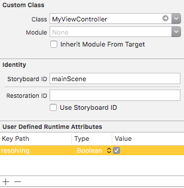

#  Resolver: Storyboards

## Property Injection

Resolver supports automatic UIViewController property injection using the StoryboardResolving protocol, but using it requires two steps.

Let's assume the following view controller, which needs a XYZViewModel in order to function.

```
class MyViewController: UIViewController {
    var viewModel: XYZViewModel!
}
```
### Step 1: Add the resolution factory method.

Add the following to your section's [xxxxx+Injection.swift file](Registration.md#files):

```
extension MyViewController: StoryboardResolving {
    func resolveViewController(_ resolver: Resolver) {
        self.viewModel = resolver.optional()
    }
}
```

Note that we're using `.optional()` here, since XYZViewModel is an *ImplicitlyUnwrappedOptional*.

### Step 2: Tell the Storyboard that your view controller needs to be resolved.

Go to your storyboard and add a Boolean "resolving" attribute to your view controller's Identity Inspector.



During view controller construction the resolving attribute added by the StoryboardResolving protocol will be set.

The resolving attribute handler will then call the protocol's resolveViewController method, which in turn does whatever's needed to properly setup your view controller.

From its perspective, all of its properties just magically appear, ready and waiting to use.

## An alternative approach using Interface Injection

Add the following to your section's [xxxxx+Injection.swift file](Registration.md#files):

```
extension MyViewController: Resolving {
    func makeViewModel() -> XYZViewModel { return resolver.resolve() }
}
```

And now the code contained in  `MyViewController` becomes:

```
class MyViewController: UIViewController {
    lazy var viewModel = makeViewModel()
}
```

All the view controller knows is that a function was provided that gives it the view model that it wants.

Try the two different approaches, and use the one that feels best. I tend to prefer the alternative approach, as it has fewer moving parts.

### Other Dependency Injection Systems

Some Dependency Injection systems like [SwinjectStoryboard](https://github.com/Swinject/SwinjectStoryboard) still require some variant of Step 1, but can do without Step 2.

Here's the equivalent Step 1 code in SwinjectStoryboard.

```
extension SwinjectStoryboard {
    class func setupMyStoryboard() {
        defaultContainer.storyboardInitCompleted(MyViewController.self) { (r, vc: MyViewController) in
            vc.viewModel = r.resolve(XYZViewModel.self)
        }
    }
}
```

As evident, there's more code involved, not to mention that SwinjectStoryboard also adds a bunch of Objective-C code to do method-swizzling on UIStoryboard in order to inject itself into the initialization process.

SwinjectStoryboard also prevents you from directly using UIStoryboard to instantiate UIViewControllers on your own, requiring you to substitue its own SwinjectStoryboard class instead.

The later clunkiness was one thing that prompted Resolver.
